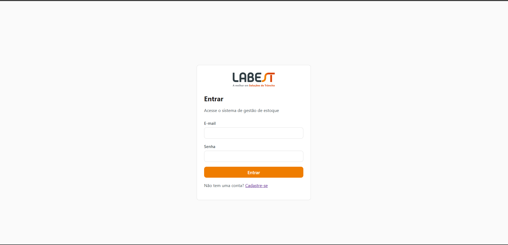
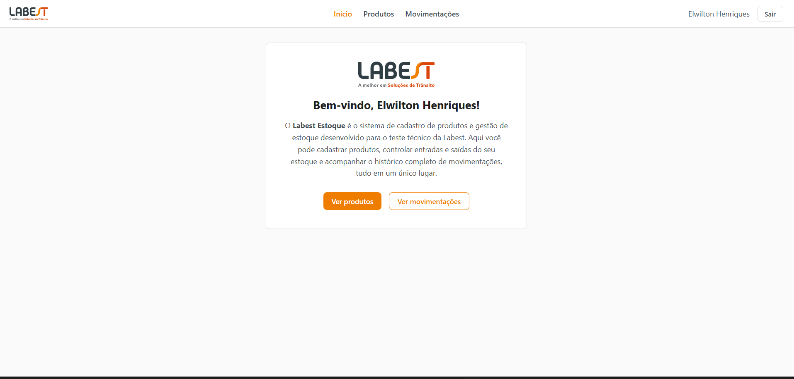
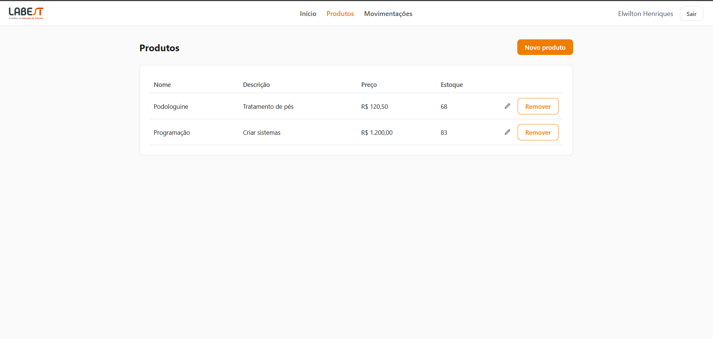
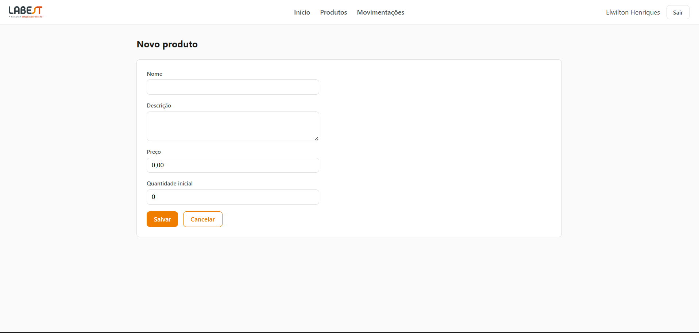
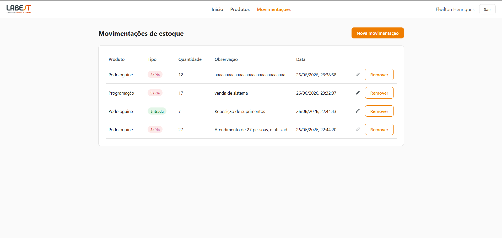
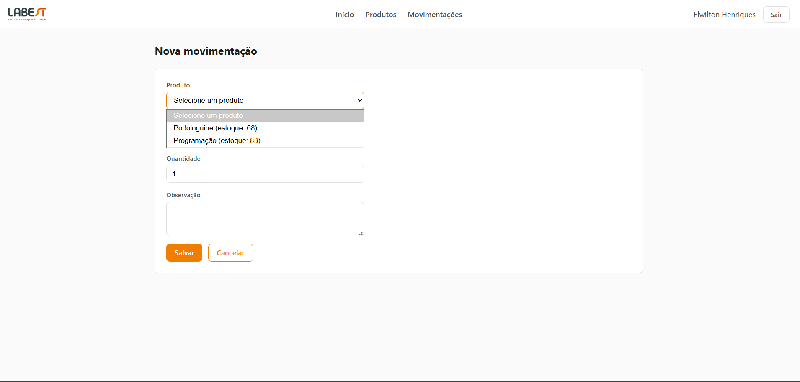

# Labest Estoque

Sistema de cadastro de produtos e gestão de estoque, desenvolvido como teste técnico para a vaga de Desenvolvedor .NET na **Labest**.

Permite cadastro/autenticação de usuários, cadastro e listagem de produtos, e registro/listagem de movimentações de estoque (entradas e saídas), com o saldo do estoque sendo recalculado automaticamente a cada movimentação.

## Visão geral

| | |
|---|---|
| **Back-end** | C# / .NET 10 (ASP.NET Core Web API) |
| **Front-end** | Vue 3 + Vite |
| **Banco de dados** | SQL Server (via Entity Framework Core) |
| **Autenticação** | ASP.NET Core Identity + JWT |
| **Containers** | Docker / Docker Compose |

## Funcionalidades

- Cadastro e login de usuários (ASP.NET Core Identity + JWT)
- Cadastro, listagem, edição e remoção de produtos
- Registro de movimentações de estoque (entrada/saída), com edição e remoção
- Atualização automática do saldo de estoque a cada movimentação, com validações de domínio (ex: impedir saída maior que o estoque disponível)
- Tela inicial com visão geral do sistema

## Screenshots

### Login


### Início


### Produtos


### Cadastro de produto


### Movimentações de estoque


### Nova movimentação


## Arquitetura

O back-end segue uma arquitetura em camadas:

```
backend/
└── src/
    ├── Rox.Domain          # Entidades e regras de negócio (Produto, MovimentacaoEstoque)
    ├── Rox.Application     # Casos de uso, DTOs, validações (FluentValidation)
    ├── Rox.Infrastructure  # EF Core, Identity, repositórios, JWT
    └── Rox.Api             # Controllers, configuração da API, Swagger
```

O front-end é uma SPA em Vue 3 (Composition API), com Vue Router, Pinia e Axios:

```
frontend/
└── src/
    ├── views/       # Páginas (Login, Cadastro, Produtos, Movimentações, etc.)
    ├── components/  # Componentes reutilizáveis (ex: ConfirmDialog)
    ├── services/     # Camada de chamadas HTTP à API
    ├── stores/       # Estado global (autenticação) com Pinia
    ├── router/       # Rotas e guarda de autenticação
    └── utils/        # Funções utilitárias (formatação de data, etc.)
```

## Como executar

### Opção 1 — Docker (recomendado)

```bash
docker compose up --build
```

- Front-end: http://localhost:8081
- API: http://localhost:5000 (Swagger em `/swagger`)
- SQL Server sobe em um container isolado, sem afetar bancos existentes na máquina.

### Opção 2 — Localmente

**Back-end:**
```bash
cd backend/src/Rox.Api
dotnet run
```
A API sobe em `http://localhost:5000`.

**Front-end:**
```bash
cd frontend
npm install
npm run dev
```
O front sobe em `http://localhost:5173`.

> A primeira execução da API aplica as migrations do Entity Framework automaticamente, criando o banco de dados.

## Stack utilizada

- **.NET 10** / ASP.NET Core Web API
- **Entity Framework Core** (SQL Server)
- **ASP.NET Core Identity** + **JWT Bearer**
- **FluentValidation**
- **Vue 3** (Composition API) + **Vite**
- **Vue Router** + **Pinia** + **Axios**
- **Docker** / **Docker Compose**
